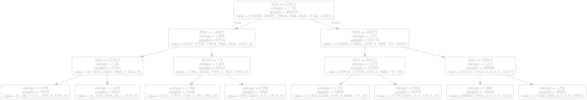

# Decision Tree

Decision Tree is a tree-based approach of learning. At each node of the tree, the model makes a decision based on the input features to ultimately make a prediction at the leaf nodes. The way Decision Tree learns from data is very intuitive&mdash;it looks at one feature at a time and splits based on how well the feature separates different output classes. As implied in its name, it works in a similar way as how we would make a decision in classifying things in the world. For example, suppose we want to classify how good a restaurant's food might be based on the reviews, pricing, and menu options. We might first believe that other people's review reflects most about the restaurant. However, because of inflated reviews, it might be common for an average place to get a rating between 3.5-4.5, so then we might want to look at the pricing of the restaurant. Depending on the pricing, we might then want to look at the number of options there are in the menu since too many choices can lead to low quality food. We are used to following this type of process when making daily decisions.

One of the main advantages of Decision Trees is precisely the fact that it is intuitive. We can look at the resulting tree and quite easily understand how the model is learning and what features is most important in the learning task. Another advantage is that with good implementation and regularization, Decision Trees can learn large amounts of data extremely quickly. Although a single tree might not do as well as other learning methods (fast learning generally doesn't allow for good accuracy), many random trees can also easily be used for _ensemble learning_, and this method of learning is called _Random Forest_. Although Random Forest is made up of simple individual trees, it is one of the most widely used machine learning algorithms today.

## Code Implementation

In this project, the Decision Tree is implemented using the ID3 approach. ID3 uses _entropy_ values in order to choose a feature to split on. The main idea of this approach is to pick a feature that would give us the most information about the output class. A feature that is deterministic with the output gives us the most information while a feature that is irrelevant to the output gives us little information. Entropy gives us a way we can calculate this information. The formula for Entropy is given by:

$$\text{Entropy}(p) = -p \text{log}_2(p)$$

The basic intuition of entropy is that given a probability value $p$, $`\text{Entropy}(p)`$ gives a qualitative value for how random a draw from $p$ is. For example, a Bernoulli with probability of 0.5 has the most entropy since the draws are the most random, and probability 0 gives 0 entropy since the draws are deterministic. 

The ID3 algorithm calculates the information gain at each stage by:

$$\text{Gain}(S, F) = \text{Entropy}(S) - \sum_{f \in values(F)} \frac{|S_f|}{|S|}\,\text{Entropy}(S_f)$$

where $S$ is the current set of data, $F$ is specific feature from the set of input features, $f \in values(F)$ represents a value $F$ can take, and $S_f$ is $S$ with $f$ as the $F$ feature. We calculate the Gain of each feature and choose the one with the highest Gain to split the tree on. Observe that in this equation, $\text{Entropy}(S)$ is not reliant on $F$, so we can actually just find $`\sum_{f \in values(F)} {\Large\frac{|S_f|}{|S|}}\,\text{Entropy}(S_f)`$ then split on the feature with the lowest of this value.

When training, we first use the full training data. Then, we compute the Gain of each feature to find the best feature to split on. We then recursively pass in a partitioned dataset that is split on each value of the feature until we reach a split that has no ambiguity with the output label, at which point it is considered a leaf node. In my implementation, the resulting tree is constructed using Python dictionary. 

The keys of the dictionary are n-tuples, where the first n-1 elements are tuples representing the path of the tree with the first entry represents the feature split on and the second entry is what value that feature took in this specific path. The $n^{th}$ element is a scalar representing the current feature we are splitting on. For example, if the key is ((3, 1), (2, 0), 1), we first split on the $3^{th}$ (counting from 0) feature which took the value of 1, then split the partitioned data at the $2^{th}$ feature which took the value of 0, and now we are further splitting on the $1^{th}$ feature. 

The value for each key is a list, where the index represents the value of the current feature and the element at that index is the next feature to split on. If the element is also wrapped as a list, it is a leaf node and the value is the output label of the leaf node. After training,the tree can then simply be traversed down at test time until a leaf node is reached which is the prediction.

### Debug and Evaluation

The debug dataset trained on `lenses.arff` was tested on the `all_lenses.arff` and scored 0.33 as expected. The predictions that was exported as a `.csv` file matched with the `.csv` file provided. When using just the `lenses.arff` and doing a 70-30 split for train and test data, the model performed between 0.6-0.875 on the test set. For the evaluation data, the model was trained on `zoo.arff` and tested on `all_zoo.arff`. The score was 0.15 and the resulting predictions were saved in a `.csv` file that is included in the folder with code. 

## Cars and Voting Dataset

The Cars dataset is a small dataset that has 6 input features which represent the pricing and comfort of a car. The labels of each is the acceptability of the car. The Decision Tree model was trained on the Cars dataset using a 10-fold cross validation. The result of this experiment is summarized in a table below. 

<table align="center">
  <thead>
    <tr>
      <th colspan=12>Cars dataset 10-fold cross validation result</th>
    </tr>
  </thead>
  <tbody>
    <tr>
      <th></th>
      <th>1</th>
      <th>2</th>
      <th>3</th>
      <th>4</th>
      <th>5</th>
      <th>6</th>
      <th>7</th>
      <th>8</th>
      <th>9</th>
      <th>10</th>
      <th>Average</th>
    </tr>
    <tr>
      <th>Train Accuracy</th>
      <th>100</th>
      <th>100</th>
      <th>100</th>
      <th>100</th>
      <th>100</th>
      <th>100</th>
      <th>100</th>
      <th>100</th>
      <th>100</th>
      <th>100</th>
      <th>100</th>
    </tr>
    <tr>
      <th>Test Accuracy</th>
      <th>89.66</th>
      <th>91.95</th>
      <th>91.95</th>
      <th>94.83</th>
      <th>95.38</th>
      <th>93.02</th>
      <th>90.70</th>
      <th>94.77</th>
      <th>94.19</th>
      <th>91.23</th>
      <th>92.77</th>
    </tr>
  </tbody>
</table>

The Voting dataset is a data that shows people's voting pattern and the political party they are associated with. The input feature consists of people's opinion about certain policies and the label is which party they belong to. The model was trained and tested in the same way as above using 10-fold cross validation. The results are summarized in a table below.

<table align="center">
  <thead>
    <tr>
      <th colspan=12>Voting dataset 10-fold cross validation result</th>
    </tr>
  </thead>
  <tbody>
    <tr>
      <th></th>
      <th>1</th>
      <th>2</th>
      <th>3</th>
      <th>4</th>
      <th>5</th>
      <th>6</th>
      <th>7</th>
      <th>8</th>
      <th>9</th>
      <th>10</th>
      <th>Average</th>
    </tr>
    <tr>
      <th>Train Accuracy</th>
      <th>100</th>
      <th>100</th>
      <th>100</th>
      <th>100</th>
      <th>100</th>
      <th>100</th>
      <th>100</th>
      <th>100</th>
      <th>100</th>
      <th>100</th>
      <th>100</th>
    </tr>
    <tr>
      <th>Test Accuracy</th>
      <th>88.64</th>
      <th>86.36</th>
      <th>100</th>
      <th>95.45</th>
      <th>100</th>
      <th>93.18</th>
      <th>93.18</th>
      <th>93.02</th>
      <th>92.86</th>
      <th>97.62</th>
      <th>94.03</th>
    </tr>
  </tbody>
</table>

## Summary of Learning for Cars and Voting

In this section, I will describe how the resulting tree shows what the model has learned for both the Cars and Voting data. Because these trees are very deep, I will only summarize the most important features the tree has used and the places where the decision could be made without going too deep.

For Cars, the most important feature about the acceptability of the car is the safety. When the car is considered unsafe (low on the safety feature), it is automatically deemed unacceptable no matther what the other features are. When the safety is medium or high, the next most important feature was the capacity of the car. A 2 person car is unacceptable no matter the other features as well. It seems that overall, cars with higher capacity is more acceptable. The next most important feature is the buying price of the car. In general, the lower the buying price the more acceptable the car is.

For Voting, The most informative feature is the physician-fee-freeze attribute. If the voter responded 'n' for this feature, adoption-of-the-budget-resolution feature is the next most informative feature. All those that responded 'y' or didn't respond were democrats. Otherwise, almost all of them were republicans. If the voter responded 'y' for physician-fee-freeze, synfuels-corporation-cutback is the next most informative feature. 

The interesting thing about the Voting dataset is that the most important features Decision Tree used to split on was also the most important features Perceptron classifier put its weights on. This shows that no matter which machine learning algorithm we use, the features will be used in similar ways.

## Handling Missing Values for Voting

The Voting data was presented with many missing values in the input. There are many ways to approach this problem. For this dataset, I thought that the most adequate approach would be to simply use the missing value as a feature of its own. This is because the missing values don't represent an error in recording, but a conscious decision of the voter to not respond. As stated in the `.arff` file, it reads "It is important to recognize that '?' in this database does not mean that the value of the attribute is unknown.  It means simply, that the value is not 'yea' or 'nay'". This statement is pretty indicative of the fact that it wouldn't be a good idea to use 'y' or 'n' to replace the missing values and supports the choice of using it as a separate feature. 

## Scikit-learn's Implementation

The most noticeable difference when using the Scikit-learn's implementation is speed of training. 10-fold cross validation on the Cars and Voting data took a good 5 seconds using my implementation but was instantaneous with Scikit-learn's. I tried using different hyperparameters like the `max_depth`, `max_leaf_nodes`, `min_samples_leaf`, `min_samples_split`, and `min_impurity_decrease` but non of those parameters improved the cross validation accuracy. However, using the Gini criterion seemed to improve the accuracy compared to the Entropy criterion. The average accuracies it got for the two datasets were 98.09\% and 98.55\% for Cars and Voting data respectively. 

The dataset I chose for the final experiment is the UCI Covertype dataset, which uses different features such as elevation, slope, soil type, etc. of a forest to predict the cover type of the forest which is an integer between 1 and 7. The input is composed of 54 features with a mixture of continuous and nominal features. This is a large dataset with 581,012 data points. I found that even with such large data with many features, not many of the hyperparameters were helpful in improving its generalization. It almost seemed like the Scikit-learn had a built in method to help generalize at test-time (although I'm not sure of this). The `max_depth` parameter was set to 50 to help it train within a reasonable amount of time. For this data, entropy was a better criterion than Gini. The average test set accuracy I got was 93.94\%.

## Graphviz

The resulting tree was saved using Scikit-learn's `export_graphviz` function. Because the actual tree is very dense and large, I only used the top 3 levels for visualization.

  

